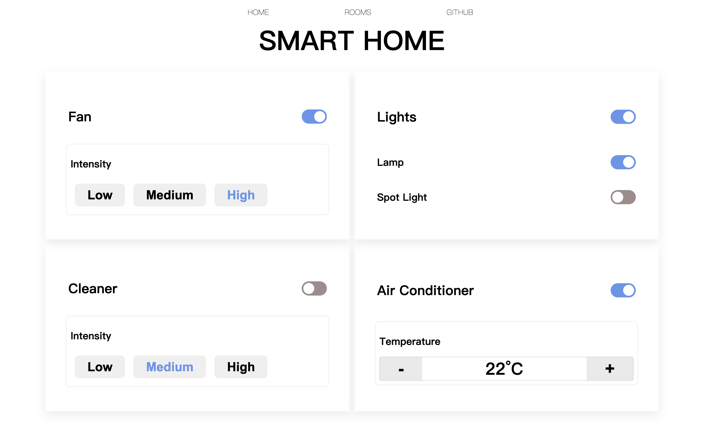

# SMART-HOME

This project is a simple web application created using React.

## Preview

## How to run this project

Run `npm start` and Open [http://localhost:3000](http://localhost:3000) to view it in your browser.

If something goes wrong, check your node version ( use `node -v`) to make sure you have node installed.

## Todos

- [ ] zoom-in/out friendly css

- [ ] add more rooms

- [ ] put it on server

- [ ] more icons

  
